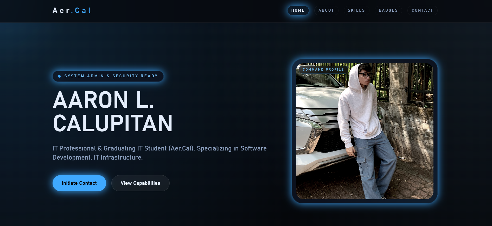

# Aaron Portfolio (React + Tailwind CSS)

This portfolio has been migrated from static HTML/CSS into a React app powered by Vite and styled with Tailwind CSS.

## Tech Stack

- React
- Vite
- Tailwind CSS
- PostCSS + Autoprefixer

## Project Structure

- `index.html` - Vite HTML entry file
- `src/main.jsx` - React mount point
- `src/App.jsx` - Main portfolio UI
- `src/index.css` - Tailwind directives and base styles
- `tailwind.config.js` - Tailwind theme configuration
- `postcss.config.js` - PostCSS plugins
- `vite.config.js` - Vite config
- `public/assets/` - Static images

## Setup

1. Install Node.js (LTS) from <https://nodejs.org>
2. Open terminal in this folder
3. Install dependencies:
   - `npm install`
4. Start development server:
   - `npm run dev`
5. Build for production:
   - `npm run build`
6. Preview production build:
   - `npm run preview`

## Notes

- The hero image now loads from `public/assets/image_4215ea.jpg`.
- If you have old static-site folders (`css/`, `js/`) from previous versions, they are no longer required.
# Aaron Calupitan - Professional Portfolio

A modern, interactive, and professionally designed portfolio website showcasing skills, experience, and certifications. Built with pure HTML, CSS, and JavaScript.



## Features

✨ **Modern Design**
- Dark theme with blue accent colors
- Fully responsive and mobile-friendly
- Smooth animations and transitions
- Professional UI/UX

🎯 **Sections**
- **Home** - Introduction and profile
- **About** - Skills and expertise
- **Contact** - Social media and contact links
- **Badges** - Certifications and achievements with progress tracking

⚡ **Interactivity**
- Smooth scroll navigation
- Active section highlighting
- Hover effects on all interactive elements
- Dynamic progress bar animation

📱 **Responsive**
- Desktop, tablet, and mobile optimized
- Fluid layouts and flexible grids
- Touch-friendly buttons and links

## File Structure

```
Aaron Portfolio/
├── index.html           # Main HTML file
├── css/
│   └── styles.css      # All styling
├── js/
│   └── script.js       # JavaScript functionality
├── assets/
│   ├── 1000075972.jpg  # Profile images
│   ├── 1000075973.jpg
│   └── result_0.jpeg
├── .gitignore          # Git ignore file
└── README.md           # This file
```

## Getting Started

### Prerequisites
- A modern web browser (Chrome, Firefox, Safari, Edge)
- No server or build tools required!

### Local Development

1. **Clone the repository**
   ```bash
   git clone https://github.com/YOUR_USERNAME/portfolio.git
   cd portfolio
   ```

2. **Open locally**
   - Double-click `index.html` to open in your browser
   - Or use a local server:
   ```bash
   # Using Python 3
   python -m http.server 8000
   
   # Using Python 2
   python -m SimpleHTTPServer 8000
   
   # Using Node.js (if installed)
   npx http-server
   ```

3. **View in browser**
   - Open `http://localhost:8000` in your browser

## Customization

### Update Personal Information

**Contact Links** (in `js/script.js`):
```javascript
if (text === 'instagram') {
    btn.href = 'https://instagram.com/yourhandle';
} else if (text === 'email') {
    btn.href = 'mailto:your.email@example.com';
}
// ... update other links
```

**Colors** (in `css/styles.css`):
```css
:root {
    --primary-color: #5B7AFF;      /* Blue accent */
    --dark-bg: #2A2A2A;             /* Dark background */
    --darker-bg: #1F1F1F;           /* Darker background */
    --gray-text: #FFFFFF;           /* Main text */
}
```

### Update Images

Replace image paths in `index.html`:
- `assets/1000075972.jpg` - Main profile image
- `assets/1000075973.jpg` - Contact section image
- `assets/result_0.jpeg` - About section image

### Update Content

Edit the HTML sections in `index.html`:
- Change name and title in **Home** section
- Update skills in **About** section
- Add social media links in **Contact** section
- Manage badges in **Badges** section

## Deployment

### GitHub Pages (Free & Recommended)

1. **Create a GitHub repository**
   - Create a new repo named `YOUR_USERNAME.github.io`
   - Or use existing repo and enable Pages in settings

2. **Push your code**
   ```bash
   git init
   git add .
   git commit -m "Initial commit: Portfolio website"
   git branch -M main
   git remote add origin https://github.com/YOUR_USERNAME/YOUR_REPO.git
   git push -u origin main
   ```

3. **Enable GitHub Pages**
   - Go to Settings > Pages
   - Select `main` branch as source
   - Your site will be live at: `https://YOUR_USERNAME.github.io`

### Other Free Hosting Options

- **Vercel** - Optimized for web projects: `vercel.com`
- **Netlify** - Easy drag-and-drop deployment: `netlify.com`
- **Render** - More server options: `render.com`

## Browser Support

- Chrome (latest)
- Firefox (latest)
- Safari (latest)
- Edge (latest)
- Mobile browsers (iOS Safari, Chrome Mobile)

## Performance

- **No dependencies** - Pure HTML, CSS, JavaScript
- **Fast loading** - Minimal file sizes
- **Lighthouse optimized** - Good accessibility and SEO
- **Mobile first** - Progressive enhancement

## License

This project is open source and available under the MIT License.

## Contributing

Contributions are welcome! Feel free to:
1. Fork the repository
2. Create a feature branch
3. Make improvements
4. Submit a pull request

## Contact & Social

- **Email**: your.email@example.com
- **Instagram**: @yourhandle
- **LinkedIn**: /in/yourprofile
- **GitHub**: github.com/YOUR_USERNAME

---

**Made with ❤️ by Aaron Calupitan**

Last updated: April 2026
